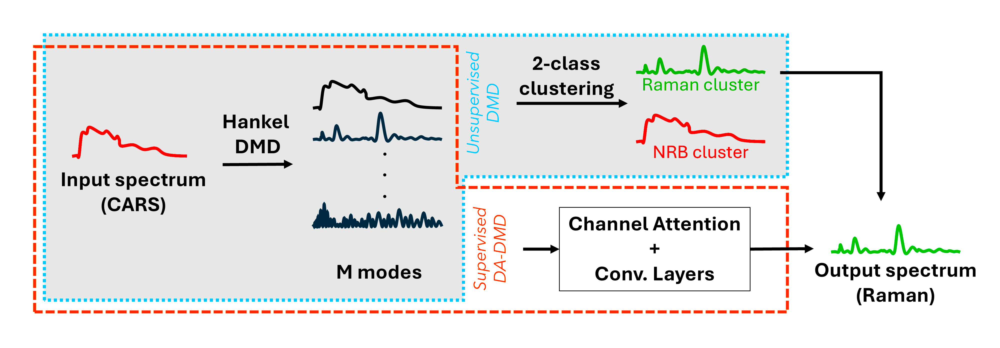

# Deep Learning-Assisted Dynamic Mode Decomposition (DA-DMD)

---

### 🔬 Overview
**DA-DMD** is a physics-informed framework currently established for removing non-resonant background (NRB) in 
Coherent Anti-Stokes Raman Spectroscopy (**CARS**) using:

- **Unsupervised DMD:** Hankelized Dynamic Mode Decomposition with 2-class clustering   
- **DA-DMD:** Deep Learning with channel attention + CNN (Adaptive weighting of DMD modes for robust Raman signal recovery)

<p align="center">
  
  <br>
  <em>Methods for NRB Removal.</em>
</p>

---

### 📄 Paper
Our method is described in:  
**Deep Learning-Assisted Dynamic Mode Decomposition for Non-resonant Background Removal in CARS Spectroscopy**  
Proceeding at *DAGM German Conference on Pattern Recognition (GCPR 2025)*  
[📥 Download PDF](valapil2025dadmd.pdf) (*postprint*)

---

### 💻 Code
Implementation available here:  
👉 [GitHub Repository](https://github.com/spectra-analysis/DA_DMD)

---

### 🎥 Video (coming soon!)
We plan to add a short video introducing DA-DMD.

---

### 👥 Authors
Adithya Ashok Chalain Valapil, Carl Messerschmidt, Maha Shadaydeh, Michael Schmitt,  
Jürgen Popp, Joachim Denzler

**BibTeX:**

```bibtex
@inproceedings{valapil2025dadmd,
  title     = {Deep Learning-Assisted Dynamic Mode Decomposition for NRB removal in CARS Spectroscopy},
  author    = {Adithya Ashok {Chalain Valapil} and Carl Messerschmidt and Maha Shadaydeh and Michael Schmitt and Jürgen Popp and Joachim Denzler},
  booktitle = {DAGM German Conference on Pattern Recognition (DAGM-GCPR)},
  year      = {2025}
}
```

### 🙏 Acknowledgements
This work is funded by the European Union’s Horizon Europe research and innovation program under Grant Agreement no. 101135175.  
For more works visit [Computer Vision Group Jena](https://inf-cv.uni-jena.de/).

